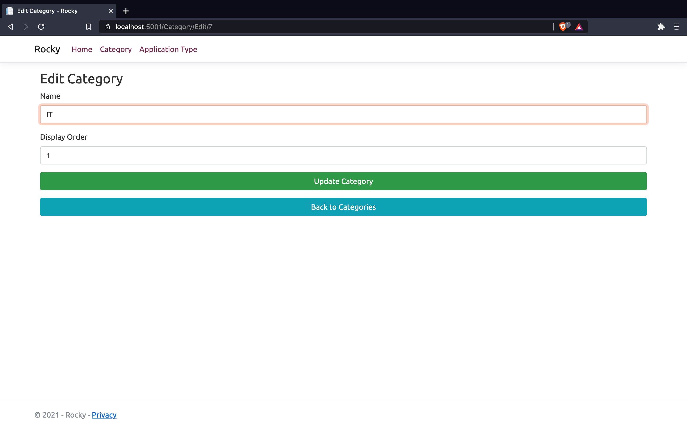

# Rocky

_Rocky is a basic CRUP Web App that was built using ASP.NET Core 5.0 Framework for the backend, Bootstrap for the frontend, and SQL Server for the DB. This application has a simple and friendly UI and all the CRUD operations on the DB. The Rocky application is just for testing purposes._

## Prerequirements

* Visual Studio 2017
* .NET Core SDK
* SQL Server

## How To Run

* Open solution in Visual Studio 2017
* Set .Web project as Startup Project and build the project.
* Run the application.

Index-Page:

Categories List:

Add Cateogory:

Edit Category:

Edit Category Validation Errors:

Delete Category:

Application Types List:

Zero Application Types in DB:

